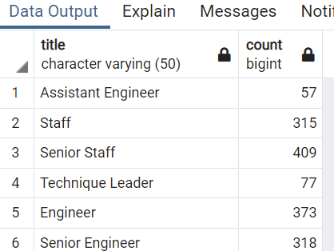

# Pewlett-Hackard-Analysis

## Overview of Project

### Purpose
The purpose of this analysis is :
1. To find out how many how many employees are eligible for retirement from each department in the company. 
2. As the company wants to start a new program to mentor the newly hired folks,it needs to find from the retirement eligible employees,
   how many of those employees will be eligible for the mentor program.

## Results

### Department wise retirement eligible employees

-From the graph and table we can observe that almost 90k eemployees are ready for retirement out of 300k which is almost 30%.
-It is contrasting that only 2 managers are eligible for retirement. 
-We can also conclude that as more number of senior engineers are ready for retirement, there will be good quality of people for mentorship program. 

### Eligible employees for mentor program. 

- We can see that out of 90k employees ready for retirement, 1500 employees are eligible for mentorship program. 
- Employees from all the department except manager are eligible to mentor new joinee. 

## Summary

### How many roles will need to be filled as the "silver tsunami" begins to make an impact?
1. Mainly the commany would need to hire manager level employees to fulfill the requirement followed by Assistant engineers and Technique leaders.

### Are there enough qualified, retirement-ready employees in the departments to mentor the next generation of Pewlett Hackard employees?
1. Company only has around 2% of retirement-ready employees eligible for mentor program which seems less for the total company population of 300k. 

### Additional query or tables
1. Having grouped number of employees based on the title from the retirement-ready list would provide more insight to understand if enough qualified
   staff is there or not. 
- Query to do so : 
	select mentorship_eligibilty.title, count(mentorship_eligibilty.emp_no)
	from mentorship_eligibilty
	group by mentorship_eligibilty.title

2. Having included the salary for these retirement-ready employees would help to decide for future hire's training cost. 