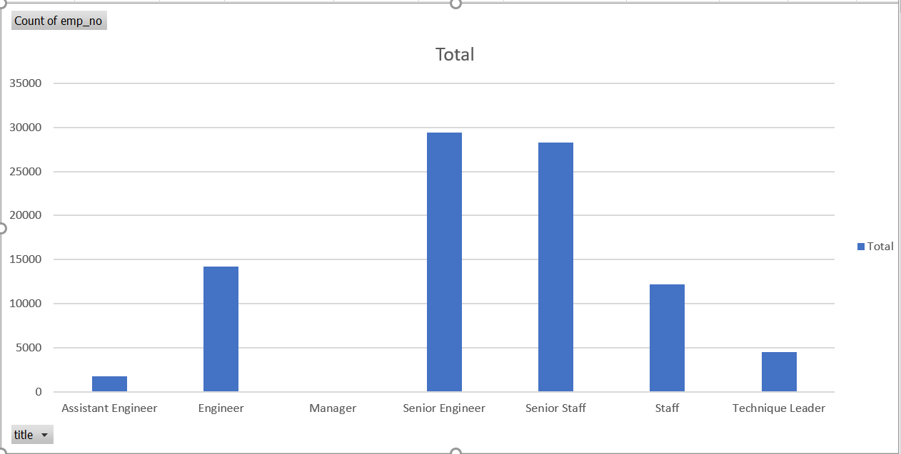
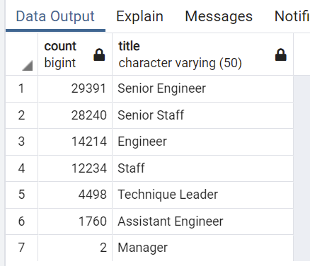
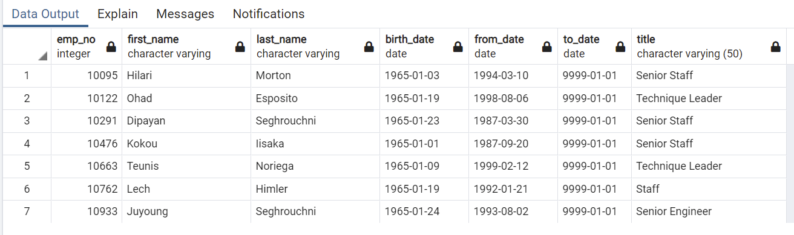

# Pewlett-Hackard-Analysis

## Overview of Project

### Purpose
The purpose of this analysis is :
1. To find out how many how many employees are eligible for retirement from each department in the company. 
2. As the company wants to start a new program to mentor the newly hired folks,it needs to find from the retirement eligible employees,
   how many of those employees will be eligible for the mentor program.

## Results

### Department wise retirement eligible employees

-From the graph and table we can observe that almost 90k eemployees are ready for retirement out of 300k which is almost 30%.
-It is contrasting that only 2 managers are eligible for retirement. 
-We can also conclude that as more number of senior engineers are ready for retirement, there will be good quality of people for mentorship program. 

### Eligible employees for mentor program. 

- We can see that out of 90k employees ready for retirement, 1500 employees are eligible for mentorship program. 
- Employees from all the department except manager are eligible to mentor new joinee. 
